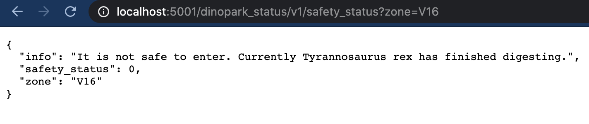
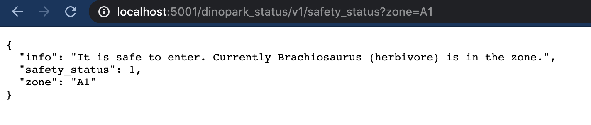
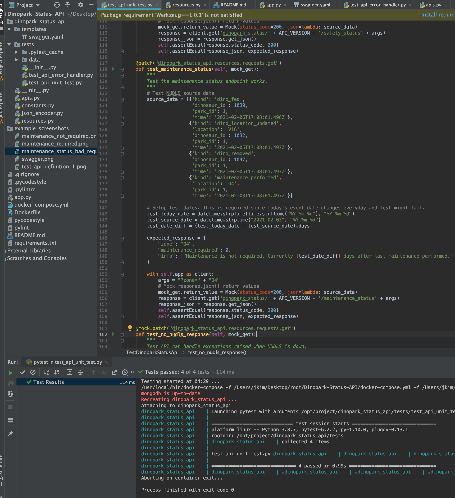

# Dinopark Status API

REST API to expose Dinopark status. Dinopark Status API exposes endpoints
for maintenance and safety status for a given unique zone identifier. 

The project runs on a docker container and it is important to have 
**Docker** and **Docker-Compose** installed on your machine to run the app.

-----

## API Specification

I have created a `swagger contract` for Dinopark Status API. It is commonly known as OpenAPI specification.
The API contract is written in `YAML` file. You can find the contract from `dinopark_status_api/templates/swagger.yaml`.

Please view the *prettier* version of the contract from online swagger editor: `https://editor.swagger.io/`.
Simply copy content of `swagger.yaml` and paste it onto the online editor.

Example:

-----

## How to setup, run and test the app

The app runs on docker container with docker-compose. 
If you don't have docker installed, please follow the guide below:

- Docker installation: https://docs.docker.com/get-docker/
- Docker compose installation: https://docs.docker.com/compose/install/

Also install Python 3 if you don't have Python installed on your machine.

-----

### Useful Docker commands:

#### docker command for Dockerfile: 

Build docker image from the Dockerfile
- `docker build -f ./Dockerfile .`

Run docker container with ports
- `docker run -d -p 5001:80 dinoparkapi`

Hit the endpoint
- `curl http://localhost:5001/<path>...`

How to remove running docker container gracefully
- `docker rm -f <container_id>` 

#### docker-compose command:

Build publishable docker image by running:
- `docker-compose -f docker-compose.yml build`

Run the container with:
- `docker-compose -f docker-compose.yml up`

Run the container by detaching. By doing this you can exec into container:
- `docker-compose -f docker-compose.yml up -d`

Exec into docker container:
- `docker exec -it <docker_container_id> bash`

Stop existing running docker container:
- `docker rm -f <docker_container_id>`

-------

### Running the app and testing

A. In the root project directory, build docker image. This might take some time depending on your system,
as you have to download base Python and MongoDB images and install dependencies for the first time.

Run in the project root directory - `docker-compose -f docker-compose.yml build`

B. Spin up App and MongoDB docker containers from the built images. 

Run - `docker-compose -f docker-compose.yml up`

You can run in detach mode to be able to exec into containers if you want with the below command:

`docker-compose -f docker-compose.yml up -d`

C. When docker containers spin up locally using docker-compose.yml, now you can test the app.
This will spin up the API and MongoDB instance.
First hit health endpoint to see if the app is running fine:

To test health endpoint:
- `localhost:5001/dinopark_status/v1/`

To test zone maintenance status:
- `localhost:5001/dinopark_status/v1/maintenance_status?zone=A1`

To test zone safety status:
- `localhost:5001/dinopark_status/v1/safety_status?zone=A1`

Example test result screenshots:

**Maintenance required:**

**Maintenance not required**

**Zone not in NUDLS logs**

**Safety status, not safe to enter**

**Safety status, safe to enter**

-------

### Data Access Layer choice - MongoDB (NoSQL)

In this project I'm running MongoDB docker container from official MongoDB image.
This is for a test purpose. See: https://hub.docker.com/_/mongo

useful MongoDB commands:

To see data entries inside MongoDB instance created from docker
- `docker exec -it <mongo_db_instance_name> bash`

To see database and collection inside the mongo container shell
- `mongo` - start mongo shell inside mongodb container
- `show dbs`
- `use <database_name>`
- `show collections`
- `use <collection_name>`
- `db.stats`
- `db.<collection_name>.find().pretty()` - show all the entries
- `db.<collection_name>.remove({})` - to delete all documents

MongoDB (document DB) is a good choice for unstructured data and we can set
the zone number as a partition key to improve the query performance when searching for
status of a zone.

------

### Code style checker and static analysis

Code style and static analysis can be done using `pycodestyle` and `pylint`
In the project root, run `./pycodestyle` and `./pylint`. This will run `pycodestyle`
and `pylint` binary files and return scores.

------

### Running code test

- I have used `docker-compose` as a remote interpreter in PyCharm IDE, this means 
you can run, debug and test the app in an isolated environment right from the IDE.
useful link: https://www.jetbrains.com/help/ruby/using-docker-compose-as-a-remote-interpreter.html

Just in case you can't run test on your own machine, the screenshots are included below:

**test_api_error_handler.py**

-------

**test_api_integration.py**

------

### How I approached the problem

I first looked at the requirements outlined from introduction page and I went on reading the given information
and try to understand the bigger picture. I thought about what problems this API need to solve (provide information
about zones in the park to reduce mortality rate) and tried to 
gather as much information as possible i.e. maintenance is needed for every 30 days etc.

In terms of maintenance, I retrieved maintenance information from NUDLS logs and worked out
the difference between today's date (when API was called) and the last date the maintenance was performed.
If the difference in days is <= 30, means no maintenance is required. If difference is > 30, maintenance is required.

In terms of safety, I created a simple algorithmic flow. Given the information about safety:
I created look up dictionary for each dinosaur based on their "id" mapped to species, type, digestion time, removal date etc.

1. Check if dinosaur is herbivore. `If yes -> safe` `if no -> go to next point`

2. Check if dinosaur was removed. `If yes -> check if it was removed before or after location update`.
if removal date > updated date, it's safe to enter. Else, dinosaur was removed before but added again. `If no -> dinosaur was not removed,
go to next point`

3. Check if dinosaur was fed. `If no -> not safe to enter.`
`If yes -> check if (fed_time + digestion_time) < today (when API was called), thus, not safe. Else, 
(fed_time + digestion_time) >= today, dinosaur is still digesting thus safe to enter.`
  
4. Return safety status of the zone with information about dinosaur (species).  

On a more technical side:

After seeing the bigger picture and understanding the problem, I went on designing the endpoints and general architecture
of the API system. I created an API contract using swagger file that outlines all the endpoints and how to use the API.
Also thought about which database system I want to use for the API.

I went on creating basic codebase for the API in Python Flask micro-framework and started building a
minimum viable product (MVP) as quickly as possible. After making an MVP, I integrated MongoDB (choice of my DB)
using docker and created basic database integration. After that, I wrote basic tests.

After writing basic test, I incorporated required business logic in the API endpoints and finished tests with `mocking`
included where necessary. Here `mocking` I'm referring to mocking HTTP request and response. The test also runs integration test 
with MongoDB instance created locally.

End to end test for all endpoints done after development.

------

### Things to do differently?

- I would create MongoDataAccessLayer class interface with methods. Didn't want to make the project too complex.
Creating a Mongo DAL class interface would make mocking and testing a lot eaiser.

- Use production ready WSGI HTTP server such as Gunicorn.
Currently the project uses Flask's default web server which is not suitable for production level.

- Database choice. I would use a cloud provider hosted DB. Such as Azure Cosmos DB.

- Perhaps, add OAuth authorization protocol using JWT as a token

- Maybe use `FastAPI` framework which reduces development time.

- In terms of business logic, I would engage a lot more with the stakeholders
to find out if there are any edge cases to write more robust tests. For example, will
NUDLS monitoring log return multiple logs with same zones? This enables a developer
to design more robust system.

------

### What I learned during the project 

- I learned that understanding the problem before coding is really, really important.
- I learned communication with backend consumers is really important to understand the requirements.
- I learned writing readable, production level code is really important for maintenance later.
- I learned writing good and robust tests that covers edge cases is crucial.
- More technically, I learned how to setup MongoDB instance locally and spin up using docker-compose to integrate with the API.
- I learned to write detailed `README.md` which is really important for someone who doesn't have context about the project.  

------

### How I think the challenge can be improved?

I think the assignment has good components to assess a developer's skills so I don't think it has to be more fancier. 
But perhaps, you can include a task that involves more HTTP methods such as DELETE/PUT etc. Or you can ask the candidate
to implement a OAuth protocol but maybe that will take a bit longer to complete. Or perhaps, you can give the candidate
a free tier cloud resource and ask the candidate to host the app in cloud or use cloud hosted DB to see the data real time. 

------

### Technical questions outlined:

A. To make the service more resilient and meet the desired SLAs for HA, the most important factor is to remove single point of failure.
I would consider scaling the service horizontally using cloud native. This is probably costly but it is most error prone and it's fast.
It suits for production purpose. We can use cloud providers such as AWS or Azure and host the app/service in Azure Kubernetes Services
or Elastic Kubernetes Services. The apps are running in container so orchestration tools like Kubernetes would handle replicating the app
and also auto-scale and start the new replica app when one goes down etc. These cluster services come with fully managed load balancers
to distribute the load and increase reliability of the app. I would also consider going fully cloud based managed databases that guarantees
99.99% uptime and SLAs. Databases such as Azure CosmosDB (document DB) or AWS DynamoDB are options. These databases can achieve HA
with replicas (also allows database sharding to distribute the load and store data on multiple db machines). 
You can also set up disaster recovery (DR) clusters and configs.

B. To handle the scaling, I would consider going horizontal scaling using cloud native as answered in part 1. If the park is housing
a few million dinosaurs, that means more maintenance zones and obviously more logs, and more requests will be made to maintain the park.
For a given solution:

1. I expect the API web server will be very slow i.e. response time will be extremely slow Connection/Timeout issue is guaranteed, since I'm using non-production web server
i.e. using Flask's built in web server. This is problem because Flask runs on single threaded mode handling one request at a time
so I would probably change the web server to production ready WSGI such as Gunicorn plus, I would change the app's run mode to threaded=True.
With Gunicorn having multiple workers and threads, hosted on Kubernetes cluster managed with Rancher server etc. would allow parallel request handling.

2. I'm currently using local MongoDB instance running as a docker container locally. This is never going to scale and it's going to break by throwing
throttling issues or connection timeout etc. because there is no SLA in these instances. So the service will be unavailable and break.
Writing and reading speed will also be very slow. One solution is to go cloud native and use cloud databases. You can increase throughput of the database
as much as you want. Choice of NoSQL such as MongoDB for schema-less unstructured data is good and I would go for NoSQL cloud databases such as Azure Cosmos DB for example.
With cloud hosted databases as the data stored in the db gets larger and larger with more dinosaur and write queries, dbs can operate faster. 
In these databases we can set partition keys to improve query performance significantly in case we have to read some data from the database. 
Also sharding of db allows distribution of data load across multiple machines. There would be almost 0 downtime of the cloud hosted databases, 
which means our service will be able to handle multiple requests writing data to the database i.e. external dependencies won't be issue.

3. We could also optimise the code itself to gain performance. For example we could use frameworks that show good benchmark. In Python
we could opt for frameworks like FastAPI. Or we could design API to cache the data i.e. cache the external API requests etc.
Also design API to handle parallel requests in code with help of production ready webserver (look at point 1) 
But we could also go fully serverless using services like AWS Lambda and AWS API Gateway.
You pay for what you use, you won't have to worry about managing clusters etc. Achieve guaranteed high SLAs with experienced engineer support.  

C. 